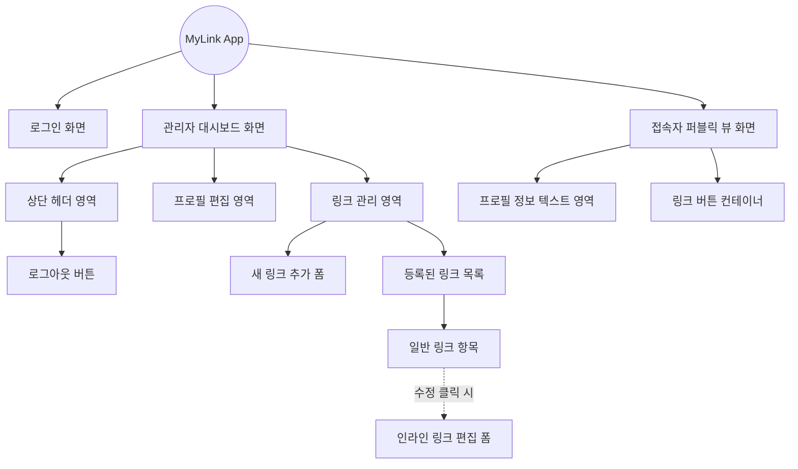

# 🖼️ 마이링크 (MyLink) - 화면 와이어프레임 (Wireframe)

본 문서는 마이링크 서비스의 화면 구조와 배치를 시각적으로 이해하기 위한 와이어프레임입니다. 화면은 크게 **관리자 대시보드**와 **퍼블릭 뷰(접속자 화면)** 두 가지로 나뉩니다.

---

## 1. UI 컴포넌트 구조도 (Component Tree)

서비스를 구성하는 화면 단위와 하위 컴포넌트의 계층 구조입니다.



---

## 2. 모바일 화면 ASCII 아트 와이어프레임

기기의 가로폭이 좁은 모바일 화면을 기준으로 앱에 표시될 주요 레이아웃을 스케치했습니다.

### 2.1 관리자 대시보드 (Admin Dashboard)

상단 내비게이션 바에 로그아웃 버튼을 두었으며, 별도의 페이지 이동이나 팝업창 없이 모든 작업(프로필 편집, 링크 추가, 기존 링크의 인라인 개별 편집)이 단일 페이지에서 세로 스크롤만으로 이루어집니다.

```text
+-----------------------------------------+
| MyLink Dashboard             [로그아웃] |
+-----------------------------------------+
|                                         |
| [ 프로필 편집 ]                         |
| 닉네임                                  |
| +-------------------------------------+ |
| | my_nickname_123                     | |
| +-------------------------------------+ |
| 소개글                                  |
| +-------------------------------------+ |
| | 안녕하세요! 프론트엔드 개발자입니다.| |
| +-------------------------------------+ |
|                           [프로필 저장] |
|-----------------------------------------|
|                                         |
| [ 새 링크 추가 ]                        |
| 타이틀                                  |
| +-------------------------------------+ |
| | 새로 추가할 링크 제목               | |
| +-------------------------------------+ |
| URL                                     |
| +-------------------------------------+ |
| | https://example.com                 | |
| +-------------------------------------+ |
|                                 [추가]  |
|-----------------------------------------|
|                                         |
| [ 내 링크 목록 ]                        |
|                                         |
|  +-----------------------------------+  |
|  | [🎨] 포트폴리오 사이트 (일반 뷰)  |  |
|  |             [수정] [삭제]         |  |
|  +-----------------------------------+  |
|                                         |
|  +-----------------------------------+  |
|  | (인라인 수정 상태인 링크 항목)    |  |
|  | 타이틀: [ 포트폴리오 사이트 2 ]   |  |
|  | URL  : [ https://...         ]    |  |
|  |             [수정 완료] [취소]    |  |
|  +-----------------------------------+  |
|                                         |
+-----------------------------------------+
```

### 2.2 접속자 퍼블릭 뷰 (Public View: `mylink.com/username`)

방문자가 고유 주소로 들어왔을 때 보게 되는 접속자 전용 화면입니다. 사용자의 프로필 텍스트 아래에 링크가 한 줄씩 나열되어 있으며, 좌측에는 API로 불러온 대상 사이트의 아이콘(파비콘)이 포함됩니다. (이 화면은 방문자가 링크를 클릭해 바깥으로 나가는 용도로만 사용됨)

```text
+-----------------------------------------+
|                                         |
|                                         |
|                                         |
|             my_nickname_123             |
|                                         |
|    안녕하세요! 프론트엔드 개발자입니다. |
|                                         |
|                                         |
|                                         |
|   +---------------------------------+   |
|   |  [🎨] 포트폴리오 사이트         |   |
|   +---------------------------------+   |
|                                         |
|   +---------------------------------+   |
|   |  [G] 구글 개발자 블로그         |   |
|   +---------------------------------+   |
|                                         |
|   +---------------------------------+   |
|   |  [G] 깃허브 Repository          |   |
|   +---------------------------------+   |
|                                         |
+-----------------------------------------+
```

## 3. 화면별 상태 및 UI 동작 세부사항 (Interaction)
1. **인라인 수정 폼:** 링크 항목 하단의 `[수정]` 버튼을 클릭하면, 일반 텍스트 라벨 부분이 즉시 입력창(Input)으로 변환됩니다. 수정을 마치고 `[수정 완료]`를 누르면 다시 일반 뷰로 축소 리렌더링됩니다.
2. **구글 파비콘 표시:** 접속자 화면과 관리자 대시보드 리스트 좌측에 표시된 대괄호(예: `[G]`) 부분은, 시스템 내부적으로 구글 API(`https://s2.googleusercontent.com/s2/favicons?domain=...`)를 호출해 출력된 이미지(Img 태그)가 삽입되는 공간입니다.
